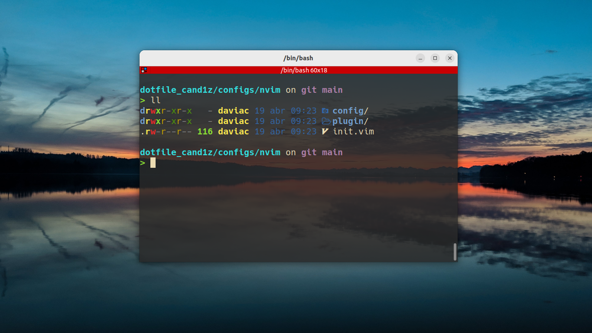

# Davi's dotfiles.

My powershell and nvim configuration.

## Content

Everything that I use for work and study listed in that repo:

- NeoVim 
- Bash
- Powershell

Things that I use that don't are in this repo:

- VS Code
- IntelliJ
- Eclipse (Sometimes)

I don't see a reason to put here the IDEs configs.

## NeoVim Setup

Requires NeoVim (>= 0.9)

- [tpope/vim-fugitive](https://github.com/tpope/vim-fugitive) - Vim plugin for Git
- [cohama/lexima.vim](https://github.com/cohama/lexima.vim) - Auto close parentheses and repeat
- [nvim-treesitter/nvim-treesitter](https://github.com/nvim-treesitter/nvim-treesitter) - Highlight
- [nvim-telescope/telescope.nvim](https://github.com/nvim-telescope/telescope.nvim) - Highly extendable fuzzy finder over lists 
- [nvim-tree/nvim-web-devicons](https://github.com/nvim-tree/nvim-web-devicons) - Icons for telescope

## Bash Setup (Linux)
- [Starship](https://starship.rs/) - Prompt theme engine
- [Nerd Fonts](https://github.com/ryanoasis/nerd-fonts) - Fonts
- [Terminator](https://gnome-terminator.org/) - Terminal
- [exa](https://the.exa.website/) - Substiture for ls (alias to ls commands in bashrc)
- [z](https://github.com/rupa/z) - Directory jumper

## Powershell Setup (Windows)

- [Scoop](https://scoop.sh/) - A command-line installer
- [Git for Windows](https://git-scm.com/)
- [Oh My Posh](https://ohmyposh.dev/) - Prompt theme engine
- [Terminal Icons](https://github.com/devblackops/Terminal-Icons) - Folder and file Icons
- [PSReadLine](https://learn.microsoft.com/en-us/powershell/module/psreadline/?view=powershell-7.3) - Cmdlets for customizing the editing environment, used for autocompletion
- [z](https://www.powershellgallery.com/packages/z/1.1.13) - Directory jumper
- [PSFzf](https://github.com/kelleyma49/PSFzf) - Fuzzy finder
