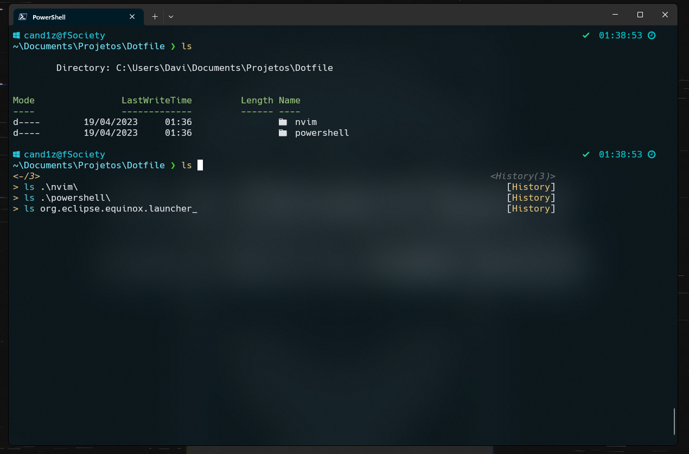
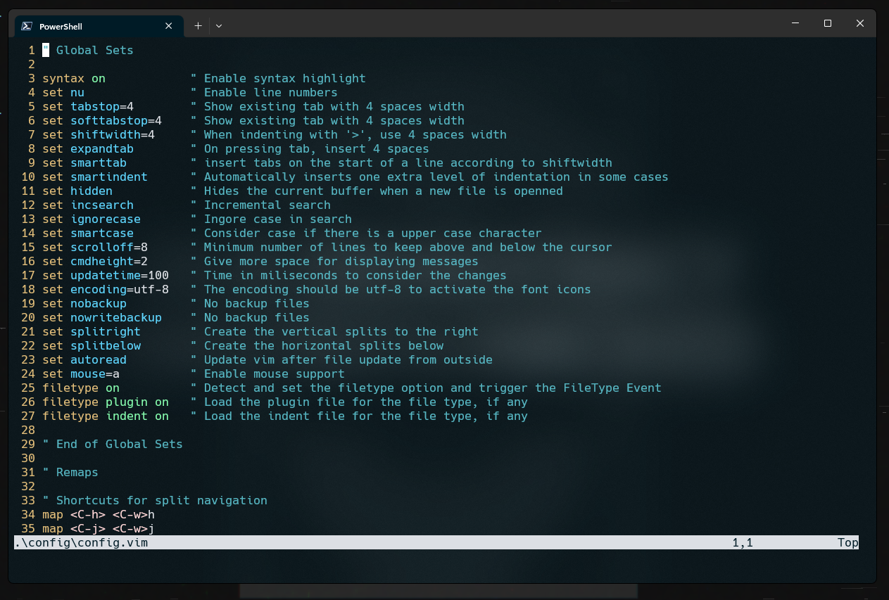

# Davi's dotfiles.

My powershell and nvim configuration.

## Content

- NeoVim config
- powershell config

## NeoVim Setup

Requires NeoVim (>= 0.9)

- [preservim/nerdtree](https://github.com/preservim/nerdtree) - File system explorer for the vim editor.
- [ryanoasis/vim-devicons](https://github.com/ryanoasis/vim-devicons) - Adds filetype icons to various vim plugins

## Bash Setup (Linux)
- [Starship](https://starship.rs/) - Prompt theme engine

## Powershell Setup (Windows)

- [Scoop](https://scoop.sh/) - A command-line installer
- [Git for Windows](https://git-scm.com/)
- [Oh My Posh](https://ohmyposh.dev/) - Prompt theme engine
- [Terminal Icons](https://github.com/devblackops/Terminal-Icons) - Folder and file Icons
- [PSReadLine](https://learn.microsoft.com/en-us/powershell/module/psreadline/?view=powershell-7.3) - Cmdlets for customizing the editing environment, used for autocompletion
- [z](https://www.powershellgallery.com/packages/z/1.1.13) - Directory jumper
- [PSFzf](https://github.com/kelleyma49/PSFzf) - Fuzzy finder
